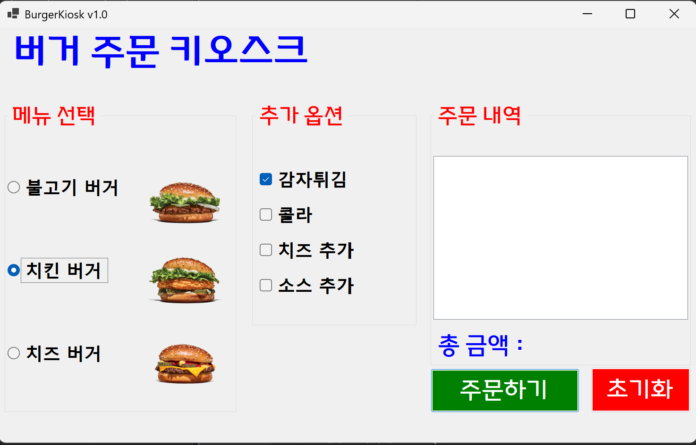

# (C# 코딩) 버거 주문 키오스크 (Burger Kiosk)

## 개요
- C# 프로그래밍 실습: WinForms를 활용하여 실제 서비스 중인 키오스크의 로직과 사용자 인터페이스(UI)를 구현하는 프로젝트입니다.
- 1줄 소개: 사용자가 라디오버튼과 체크박스를 통해 메뉴와 옵션을 선택하면 실시간으로 주문 내역과 총 결제 금액을 산출하여 보여주는 무인 주문 시스템입니다.
- 사용한 플랫폼: C#, .NET Windows Forms, Visual Studio, GitHub
- 사용한 컨트롤:
    - 입력: RadioButton (단일 메뉴 선택용), CheckBox (다중 옵션 선택용), GroupBox (컨트롤 그룹화)
    - 출력: ListBox (주문 리스트 출력), Label (금액 및 가이드 메시지 표시)
    - 동작: Button (주문/초기화 실행), PictureBox (메뉴 이미지 시각화)
- 사용한 기술과 구현한 기능:
    - 데이터 유효성 검사: 메뉴 미선택 시 로직을 차단하고 안내를 제공하는 방어적 프로그래밍 적용
    - 누적 합산 알고리즘: 가변적인 선택 조합에 따라 실시간으로 가격을 계산하는 동적 연산 로직
    - UI/UX 최적화: TabIndex 및 포커스 제어를 통한 키보드 조작성 강화와 즉각적인 피드백 시스템
    - 텍스트 포맷팅: ToString("N0") 형식을 이용한 숫자 데이터의 표준 화폐 단위(천 단위 콤마) 변환

## 실행 화면 (과제 1)
- 코드의 실행 스크린샷과 구현 내용 설명

- 구현한 내용 (위 그림 참조)
    - 시각적 직관성을 확보하기 위해 PictureBox와 라디오버튼을 조합하여 메뉴 선택 영역을 설계했으며 GroupBox를 통해 각 컨트롤의 논리적 범위를 확정했습니다.
    - 불고기 버거(4,000원), 치즈 버거(5,000원), 치킨 버거(3,000원) 중 단 하나만 선택되도록 상호 배타적 선택 로직을 구축했습니다.
    - 체크박스의 독립적인 활성화 상태를 인식하여 감자튀김, 콜라 등의 사이드 메뉴를 개별적으로 선택하고 중복 합산이 가능하도록 구현했습니다.
    - 주문하기 버튼 클릭 시 모든 입력 컨트롤의 Checked 상태를 전수 조사하여 totalCost 변수에 가격 데이터를 누적하는 중앙 집중형 연산 프로세스를 완성했습니다.

## 실행 화면 (과제 2)
- 코드의 실행 스크린샷과 구현 내용 설명

- 구현한 내용 (위 그림 참조)
    - 사용자가 필수 항목인 메인 메뉴를 선택하지 않은 채 주문을 시도하는 예외 상황을 시스템적으로 감지하여 데이터 처리의 논리적 오류를 사전에 방지했습니다.
    - 사용자의 작업 흐름을 강제로 중단시켜 심리적 저항을 일으키는 MessageBox 팝업 방식 대신, 기존 UI 내의 lblTotalCost 라벨을 재활용하여 자연스럽게 경고를 전달하는 비간섭적 인터페이스를 구현했습니다.
    - 오류 상태에 대한 시각적 인지력을 극대화하기 위해 에러 발생 시 라벨의 ForeColor 속성을 Color.Red로 변경하고 메뉴를 선택하세요라는 명확한 가이드 텍스트를 출력하도록 설계했습니다.
    - 조건문을 이용한 유효성 검사 통과 실패 시 return 문을 즉시 실행하여, 이후 단계의 복잡한 연산 로직이나 ListBox 아이템 추가 프로세스가 작동하지 않도록 제어 구조를 정밀화했습니다.
      이를 통해 비정상적인 데이터(0원 주문이나 빈 내역)가 리포트되는 것을 차단하고 프로그램 전체의 실행 무결성과 안정성을 확보했습니다.

      # 실행 화면 (과제3)

- 과제 내용:
  - 마우스 조작이 어려운 환경을 대비하여 키보드만으로 주문 전 과정을 완료할 수 있도록 UX를 개선합니다.
  - Tab 순서 최적화와 특정 키(방향키, 스페이스바, 엔터)를 이용한 조작 시스템을 구축합니다.

- 구현 내용과 기능 설명:
  - 각 컨트롤의 TabIndex를 입력 흐름에 맞게 정렬하여 Tab 키만으로 메뉴, 옵션, 버튼 사이를 자유롭게 이동할 수 있도록 설계했습니다. 그룹박스 내의 라디오버튼은 방향키로 선택을 전환하고, 체크박스는 스페이스바를 통해 토글(선택/해제)이 가능하게 하여 접근성을 높였습니다. 최종적으로 주문하기 버튼에 포커스가 있을 때 Enter 키를 눌러 주문 기능이 실행되도록 연결하여 키보드 기반 인터랙션 시나리오를 완성했습니다.

- 사용한 기술과 구현한 기능:
  - TabIndex 및 TabStop 속성 설정을 통한 포커스 이동 경로 제어
  - 윈도우 표준 컨트롤 이벤트를 활용한 키보드 입력 대응 기술

---

# 실행 화면 (과제4)

- 과제 내용:
  - 사용자가 항목을 선택하거나 변경하는 즉시 주문 내역과 가격 정보가 갱신되도록 실시간 동기화 기능을 구현합니다.
  - 선택 상태 변화에 따라 ListBox와 총 금액 Label이 즉각적으로 업데이트되는 피드백 시스템을 구축합니다.

- 구현 내용과 기능 설명:
  - '주문하기' 버튼을 누르기 전이라도 사용자가 자신의 선택을 실시간으로 인지할 수 있도록 '즉각적 피드백' 로직을 적용했습니다. 모든 RadioButton과 CheckBox의 CheckedChanged 이벤트에 공통 계산 메서드를 연결하여, 상태가 변하는 순간 즉시 ListBox의 항목을 초기화하고 현재 선택된 모든 메뉴와 가격을 다시 출력하도록 설계했습니다. 이를 통해 사용자에게 실시간 금액 변동 정보를 제공하여 시스템의 신뢰도를 높였습니다.

- 사용한 기술과 구현한 기능:
  - CheckedChanged 이벤트를 활용한 실시간 데이터 동기화
  - ListBox.Items.Clear() 및 Add()를 이용한 동적 목록 관리 기술

---

# 배운 내용

- 선택 컨트롤의 논리적 차이 이해: 하나만 선택해야 하는 메인 메뉴에는 RadioButton을, 여러 조합이 가능한 추가 옵션에는 CheckBox를 적용하며 각 컨트롤의 목적에 맞는 설계 역량을 길렀습니다.
- GroupBox를 통한 컨텍스트 분리: 하나의 폼 안에서 다수의 라디오버튼 그룹이 서로 간섭하지 않도록 GroupBox를 이용해 독립적인 선택 범위를 설정하는 법을 익혔습니다.
- 이벤트 드리븐 UI 업데이트: 사용자의 액션(클릭, 상태 변화)에 시스템이 즉각적으로 반응하게 만드는 이벤트 핸들링 기술을 통해 동적인 프로그램 제작 원리를 이해했습니다.
- 예외 처리와 UX의 결합: 런타임 오류나 사용자의 실수를 방지하는 방어적 프로그래밍과 더불어, 인라인 메시지 표시를 통해 사용자 경험을 개선하는 설계 방식을 학습했습니다.
- 공통 모듈 설계를 통한 효율성 확보: 반복되는 계산 및 출력 로직을 별도의 메서드로 분리하여 코드의 재사용성을 높이고 유지보수가 용이한 구조를 설계하는 경험을 가졌습니다.
- Git 기반의 단계별 형상 관리: 각 과제 단계마다 명확한 필수 문구가 포함된 커밋 메시지를 작성하고 푸시하며 안정적인 버전 관리 시스템 활용 능력을 내재화했습니다.

