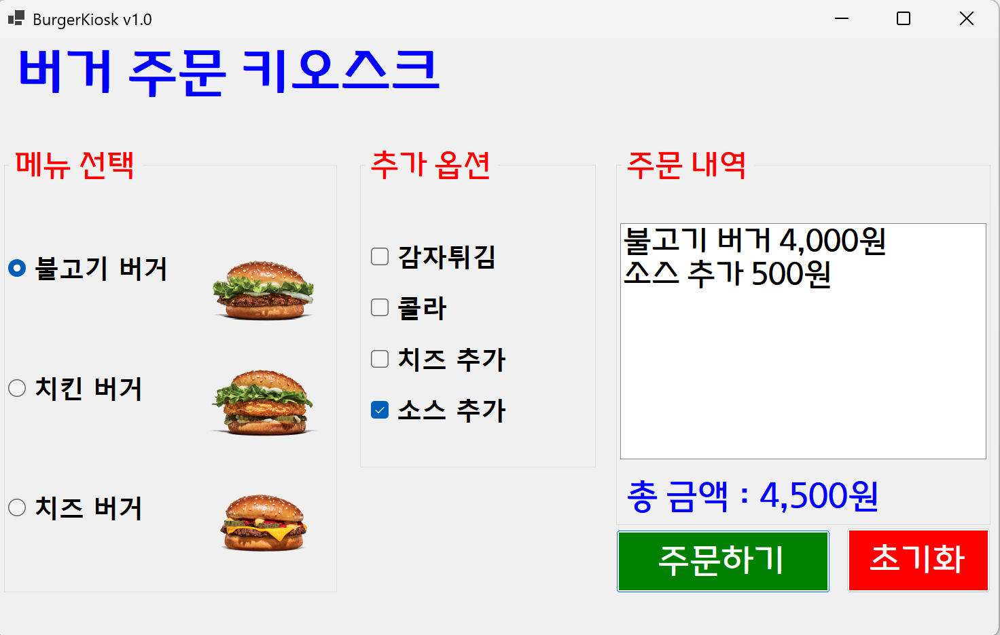
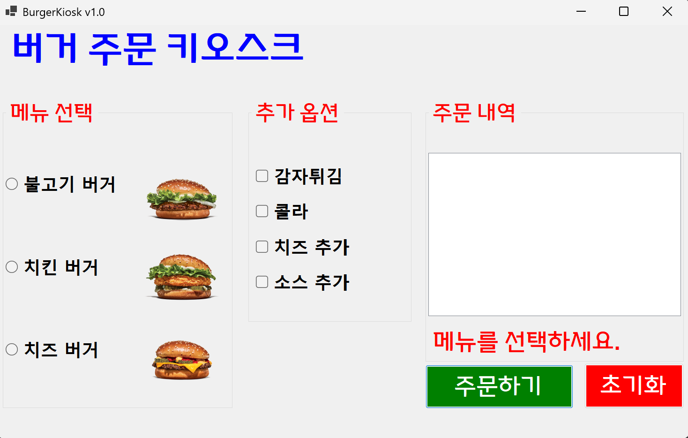

# (C# 코딩) 버거 주문 키오스크 (Burger Kiosk)

## 개요
- C# 프로그래밍 실습: WinForms를 활용하여 실제 서비스 중인 키오스크의 로직과 사용자 인터페이스(UI)를 구현하는 프로젝트입니다.
- 1줄 소개: 사용자가 라디오버튼과 체크박스를 통해 메뉴와 옵션을 선택하면 실시간으로 주문 내역과 총 결제 금액을 산출하여 보여주는 무인 주문 시스템입니다.
- 사용한 플랫폼: C#, .NET Windows Forms, Visual Studio, GitHub
- 사용한 컨트롤:
    - 입력: RadioButton (단일 메뉴 선택용), CheckBox (다중 옵션 선택용), GroupBox (컨트롤 그룹화)
    - 출력: ListBox (주문 리스트 출력), Label (금액 및 가이드 메시지 표시)
    - 동작: Button (주문/초기화 실행), PictureBox (메뉴 이미지 시각화)
- 사용한 기술과 구현한 기능:
    - 데이터 유효성 검사: 메뉴 미선택 시 로직을 차단하고 안내를 제공하는 방어적 프로그래밍 적용
    - 누적 합산 알고리즘: 가변적인 선택 조합에 따라 실시간으로 가격을 계산하는 동적 연산 로직
    - UI/UX 최적화: TabIndex 및 포커스 제어를 통한 키보드 조작성 강화와 즉각적인 피드백 시스템
    - 텍스트 포맷팅: ToString("N0") 형식을 이용한 숫자 데이터의 표준 화폐 단위(천 단위 콤마) 변환

## 실행 화면 (과제 1)
- 코드의 실행 스크린샷과 구현 내용 설명

- 구현한 내용 (위 그림 참조)
    - 영역 범주화: GroupBox를 사용하여 메뉴 선택, 추가 옵션, 주문 내역 구역을 시각적으로 격리함으로써 사용자가 작업 순서를 직관적으로 인지하도록 설계했습니다.
    - 단일 선택 로직: 라디오버튼을 그룹화하여 불고기 버거(4,000원), 치즈 버거(5,000원), 치킨 버거(3,000원) 중 반드시 하나의 주메뉴만 선택되도록 구성했습니다.
    - 복수 선택 시스템: 체크박스의 독립적 특성을 이용해 감자튀김, 콜라 등 여러 사이드 메뉴를 자유롭게 조합하여 주문할 수 있는 구조를 구축했습니다.
    - 주문 요약 출력: 주문하기 버튼 클릭 시 현재 선택된 모든 항목을 ListBox에 일목요연하게 정리하여 한 눈에 파악할 수 있게 구현했습니다.

## 실행 화면 (과제 2)
- 코드의 실행 스크린샷과 구현 내용 설명

- 구현한 내용 (위 그림 참조)
    - 비간섭적 예외 처리: 사용자가 메인 메뉴를 선택하지 않은 실수 상황을 시스템적으로 감지하여 데이터 오류를 방지합니다.
    - 인라인 가이드 메시지: 작업 흐름을 방해하는 MessageBox 팝업 대신, 기존의 lblTotalCost 라벨의 텍스트와 색상을 동적으로 변경하여 메뉴를 선택하세요라는 경고를 직관적으로 전달합니다.
    - 방어적 프로그래밍: 메뉴 미선택 시 return 문을 통해 불필요한 연산 로직이나 리스트 추가가 실행되는 것을 원천 차단하여 프로그램의 안정성을 확보했습니다.

